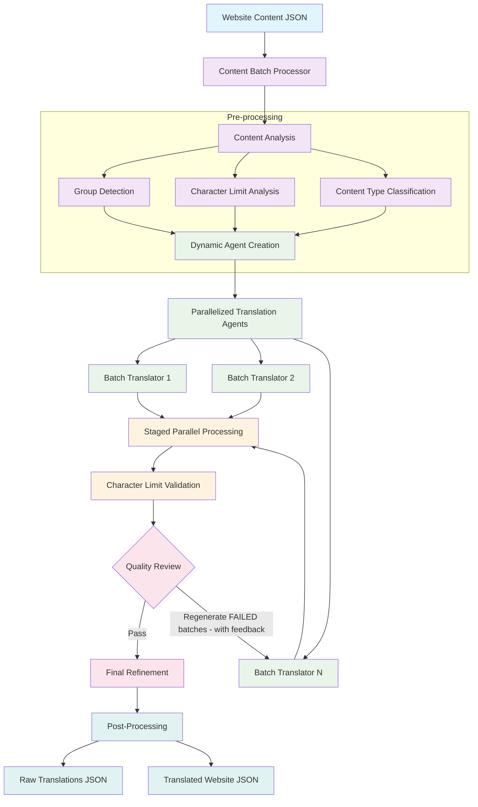

# Content-Agnostic Translation Architecture

## System Architecture Overview

```mermaid
graph TB
    %% Input Layer
    A[Website Content JSON] --> B[Content Batch Processor]
    
    %% Pre-processing Group
    subgraph PREPROCESSING ["Pre-processing"]
        C[Content Analysis]
        D[Group Detection]
        E[Character Limit Analysis]
        F[Content Type Classification]
        G[Dynamic Agent Creation]
    end
    
    %% Analysis Layer
    B --> C
    C --> D
    C --> E
    C --> F
    
    %% Agent Orchestration Layer
    D --> G
    E --> G
    F --> G
    
    G --> H[Parallelized Translation Agents]
    H --> I[Batch Translator 1]
    H --> J[Batch Translator 2]
    H --> K[Batch Translator N]
    
    %% Processing Layer
    I --> L[Staged Parallel Processing]
    J --> L
    K --> L
    
    L --> M[Character Limit Validation]
    M --> N{Quality Review}
    
    %% Quality Control Layer
    N -->|Pass| O[Final Refinement]
    N -->|Regenerate FAILED batches - with feedback| K[Batch Translator N]
    
    %% Output Layer
    O --> Q[Post-Processing]
    Q --> R[Raw Translations JSON]
    Q --> S[Translated Website JSON]
    
    %% Styling
    classDef input fill:#e1f5fe
    classDef analysis fill:#f3e5f5
    classDef agents fill:#e8f5e8
    classDef processing fill:#fff3e0
    classDef quality fill:#fce4ec
    classDef output fill:#e0f2f1
    classDef frontend fill:#f1f8e9
    
    class A input
    class B,C,D,E,F analysis
    class G,H,I,J,K agents
    class L,M processing
    class N,P,O quality
    class Q,R,S output
    class T,U,V,W frontend
```
